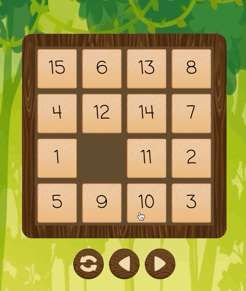

# The 15-puzzle game (PWA)
Move the tiles until you collect in order from 1 to 15. 
[Play game](https://albertgabdullin.github.io/puzzle15/)

## Description
The 15-puzzle (also called Gem Puzzle, Boss Puzzle, Game of Fifteen, Mystic Square and many others) is a sliding
puzzle that consists of a frame of numbered square tiles in random order with one tile missing.
The object of the puzzle is to place the tiles in order by making sliding moves that use the empty space.

##Preview

